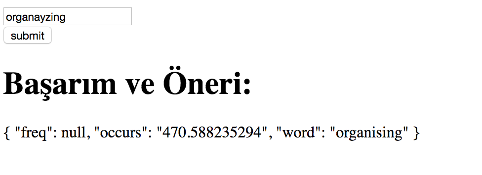
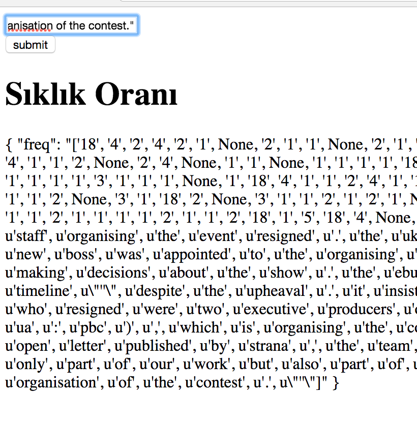

# ENGLISH DOCUMENTATION VALIDATOR FOR TURKISH AUTHORS
TLNP is a Turkish Language formatting API for creating perfect documents.At now it is on the
Raw potatoes release.

For see the Success Ratio on one word.


For see the tokenization and statistics about frequency about your words:


#NOTICE:On our road map we will add the succes score of whole paragrapgh

For use this API:

First:

For Linux
```sh
  $ sudo apt-get install python-pip python-dev build-essential
```
For OSX:

```sh

$ sudo curl https://bootstrap.pypa.io/get-pip.py > get-pip.py
$ sudo python get-pip.py

```
And after:

  This is for creating own virtual workspace.
    `$ pip install virtualenv`


After installed these modules without any error.

    `$ cd FLASK-API/
     $ source api bin/activate`

You can activate the virtualenv but you need install packages again:

     `$(api)  pip install -r requirements.txt`


(FOR YOUR HOST .)
     `$ pip install -r requirements.txt`

For run the server:

    `(api) $ python server.py`

And server is runnig:

    `localhost:5000/api`

    After client-test:
    `$ python client.py`

    `localhost:4000`


FOR USE THE ON DOCKER:
Change the directory

  ```sh
    $ cd composetest
  ```
Build container on your system:

  `$ docker-compose build`

Wake up the containers

  `$ docker-compose up`


  `localhost:5000` is default IP on your local address.

Notice:  On this docker we only added redis test service.We will integrate the other main web services.

If you did not install Docker to on your host machine look the Docker-Docs:

  [DOCKER-DOCUMENTATION](https://docs.docker.com/)
